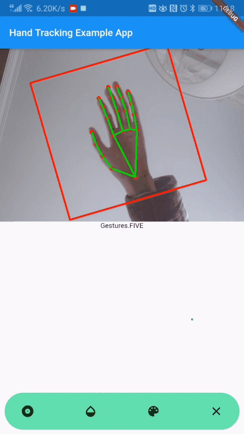
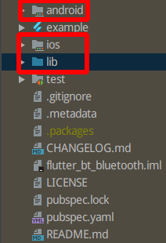
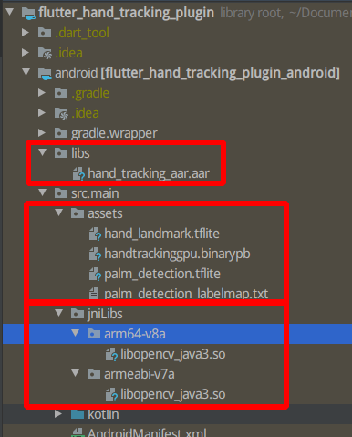
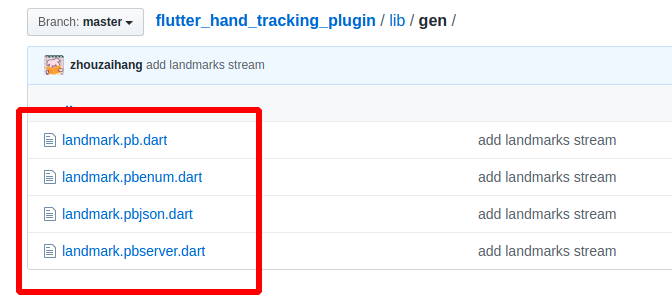

# Flutter Hand Tracking Plugin

이 Flutter Packge는 Andorid 장치 카메라를 호출하여 열 손가락의 움직임 경로/궤적 및 제스처 동작을 정확하게 추적하고 인식하기 위한 것입니다. 또한 22개의 핸드 키를 출력하여 더 많은 제스처 사용자 정의를 지원합니다. 이 패킷은 비즈니스 로직을 기반으로 제스처 정보를 실시간으로 명령 정보로 변환할 수 있습니다: 1, 2, 3, 4, 5, rock, Spiderman ... 또한 Flutter를 기반으로 다른 제스처에 대해 다른 특수 효과를 만들 수 있습니다. 짧은 비디오 라이브 효과, 스마트 하드웨어와 같은 분야에서 사용할 수 있습니다.



> 源码托管于 Github: [https://github.com/zhouzaihang/flutter_hand_tracking_plugin](https://github.com/zhouzaihang/flutter_hand_tracking_plugin)

> [Bilibili 演示](https://www.bilibili.com/video/av92842489/)

## 사용.

> 프로젝트에서 사용하는 Android/libs/hand_tracking_aar.aar는 git-lfs에서 호스팅됩니다. 다운로드한 후 .aar 파일이 존재하는지 확인해야 합니다. (그리고 파일이 100MB가 넘습니다.) 만약 git-lfs를 설치하지 않았다면 수동으로 다운로드한 다음 프로젝트 경로로 대체해야 할 수도 있습니다.

이 프로젝트는 안드로이드용 플랫폼별 구현 코드를 포함하는 특수 패키지인 Flutter 플러그인 패키지의 출발점이다.

Flutter를 시작하는 데 도움이 필요하면 튜토리얼, 샘플, 모바일 개발에 대한 지침 및 전체 API 참조를 제공하는 온라인 설명서를 참조하십시오.

## 관련된 기술

1. Flutter Plugin Package를 작성합니다.
1. Docker를 사용하여 MediaPipe 개발 환경 설정
1. Gradle에서 MediaPipe 사용하기
1. Flutter 프로그램 실행 MediaPipe 그림
1. flutter 페이지에 포함된 원본 보기
1. protobuf 사용

## Flutter Package란

Flutter Package에는 다음 두 가지 유형이 있습니다.

Dart Package: 완전히 Dart로 작성path 패킷과 같은 패킷입니다. 일부 패킷은 fluter 프레임워크에 전적으로 의존하는 fluter 고유 기능을 포함할 수 있습니다.

Plugin Package: Dart 코드로 작성된 API를 포함하는 런플랫폼에 의존하는 패키지입니다. Android (Java 또는 Kotlin 사용) 와 iOS (ObjC 또는 Swift 사용) 를 위한 플랫폼 구현물. battery 패키지와 같이.

## Flutter Plugin Package가 필요한 이유

플랫폼 간 UI 프레임워크인 Fluter는 원래 기능을 직접 호출할 수 없습니다. 만약 네이티브 시스템의 기능을 사용해야 한다면, 플랫폼 고유의 구현이 필요하며, Fluter의 Dart 계층에서 호환되어야 합니다. 여기에서는 호출 카메라와 GPU를 사용하여 비즈니스를 구현해야 합니다. 따라서 Fluter Plugin Package를 사용합니다.

## Flutter Plugin Package가 작동하는 방식

다음은 Flutter Plugin Package 프로젝트의 목록입니다.



- pubspec.yaml은 Plugin이 사용할 수 있는 종속성이나 리소스( 그림, 글꼴 등)를 추가하는 데 사용됩니다.
- example 디렉터리에 있는 전체 Fluter 앱은 Plugin을 테스트하는 데 사용됩니다.

- 또 하나의 Flutter app 프로젝트든 하나의 Flutter Plugin 프로젝트든Dart 코드를 저장할 디렉터리 3개, Android, ios, lib. lib 디렉터리가 있습니다.다른 두 디렉터리는 플랫폼 구현을 저장하기 위한 코드입니다. Flutter는 실행 중인 플랫폼에 따라 해당 코드를 실행한 다음 [Platform Channels](https://flutter.dev/docs/development/platform-integration/platform-channels?tab=android-channel-kotlin-tab)를 사용하여 코드 실행 결과를 Dart 계층으로 반환합니다.

다음은 Flutter의 공식 스키마 그림입니다.


Fluter는 운영 체제 적응 계층으로 Embedder, Engine 계층에서 렌더링 엔진과 같은 기능을 구현하기 때문에 크로스 플랫폼 프레임워크입니다. Framework 계층은 Dart로 구현된 UI SDK입니다. Flugin Package의 경우 Embedder 계층에서 직접 Framework에 연결할 수 없으며, Dart 계층에서 UI API로 캡슐화하여 크로스 플랫폼이 가능합니다. Embedder 계층은 Framework와 직접 연결할 수 없습니다.

Platform Channels를 사용하여 클라이언트(UI)와 호스트(특정 플랫폼) 간에 전달되는 과정은 다음과 같다.


## `Flutter Plugin Package`

1. `Android Studio`, `New Flutter Project`
1. 'Flutter Plugin' 옵션 선택
1. 항목 이름, 설명 등 정보 입력

## 'Android' 플랫폼 'view' 작성

먼저 'kotlin' 파일: 'FlutterHandTrackingPlugin.kt' 와 'HandTrackingViewFactory.kt' 파일을 'android/src/main/kotlin/xyz/zhzh/ flutter_hand_tracking_plugin' 디렉터리에 작성합니다.

### 'Factory' 클래스 편집

'HandTrackingViewFactory.kt' 에서 'HandTrackingViewFactory' 클래스를 만들어 추상화를 구현한 'PlatformViewFactory'. 이후에 작성된 'Android' 플랫폼 구성 요소는 모두 이 클래스를 사용하여 생성되어야 합니다. 보기를 생성할 때 들어오는 매개 변수 'id' 를 사용하여 보기를 인식해야 합니다.

``` Kotlin
package xyz.zhzh.flutter_hand_tracking_plugin

import android.content.Context
import io.flutter.plugin.common.PluginRegistry
import io.flutter.plugin.common.StandardMessageCodec
import io.flutter.plugin.platform.PlatformView
import io.flutter.plugin.platform.PlatformViewFactory

class HandTrackingViewFactory(private val registrar: PluginRegistry.Registrar) :
        PlatformViewFactory(StandardMessageCodec.INSTANCE) {
    override fun create(context: Context?, viewId: Int, args: Any?): PlatformView {
        return FlutterHandTrackingPlugin(registrar, viewId)
    }
}
```

### 'AndroidView' 클래스 만들기

`FlutterHandTrackingPlugin.kt`에서 `FlutterHandTrackingPlugin`을 작성하여 `PlatformView` 인터페이스를 구현하는데, 이 인터페이스는 두 가지 방법 `getView`와 `dispose`를 구현해야 한다.

'getView' 는 'Flutter' 인터페이스에 삽입될 보기를 되돌려줍니다

'dispose'는 닫으려 할 때 조작을 하는 것이다

먼저 'Surface View'를 추가합니다.

``` kotlin
class FlutterHandTrackingPlugin(r: Registrar, id: Int) : PlatformView, MethodCallHandler {
    companion object {
        private const val TAG = "HandTrackingPlugin"
        private const val NAMESPACE = "plugins.zhzh.xyz/flutter_hand_tracking_plugin"

        @JvmStatic
        fun registerWith(registrar: Registrar) {
            registrar.platformViewRegistry().registerViewFactory(
                    "$NAMESPACE/view",
                    HandTrackingViewFactory(registrar))
        }

        init { // Load all native libraries needed by the app.
            System.loadLibrary("mediapipe_jni")
            System.loadLibrary("opencv_java3")
        }
    }
    private var previewDisplayView: SurfaceView = SurfaceView(r.context())
}
```

`getView`를 통해 추가된 `SurfaceView`를 반환:

``` kotlin
class FlutterHandTrackingPlugin(r: Registrar, id: Int) : PlatformView, MethodCallHandler {
    // ...
    override fun getView(): SurfaceView? {
        return previewDisplayView
    }

    override fun dispose() {
        // TODO: ViewDispose()
    }
}
```

## 'Dart' 에서 네이티브로 구현된 'View' 를 불러옵니다.

> 'plugin package' 프로젝트의 'lib/fluter_hand_tracking_plugin.dart' 을 편집하기 위해 엽니다. (파일 이름은 새 프로젝트의 패키지 이름을 기준으로 합니다.)

`Flutter`에서 오리지널 `Android` 컴포넌트를 호출하려면 `Android View`를 만들고, 구성 등록 이름을 알려주어야 하며, `Android View`를 만들 때, 그룹을 준다부품 할당 `id`, 이 `id`는 파라미터 `onPlatformViewCreated` 인입 방법을 통해 얻을 수 있다

``` dart
AndroidView(
    viewType: '$NAMESPACE/blueview',
    onPlatformViewCreated: (id) => _id = id),
)
```

`Android` 플랫폼의 구성 요소만을 구현했기 때문에, 다른 시스템에서는 사용할 수 없기 때문에 `defaultTargetPlatform`을 획득하여 운행을 판단하는 플랫폼도 필요하다.

``` dart
import 'dart:async';

import 'package:flutter/cupertino.dart';
import 'package:flutter/foundation.dart';
import 'package:flutter/services.dart';
import 'package:flutter_hand_tracking_plugin/gen/landmark.pb.dart';

const NAMESPACE = "plugins.zhzh.xyz/flutter_hand_tracking_plugin";

typedef void HandTrackingViewCreatedCallback(
    HandTrackingViewController controller);

class HandTrackingView extends StatelessWidget {
  const HandTrackingView({@required this.onViewCreated})
      : assert(onViewCreated != null);

  final HandTrackingViewCreatedCallback onViewCreated;

  @override
  Widget build(BuildContext context) {
    switch (defaultTargetPlatform) {
      case TargetPlatform.android:
        return AndroidView(
          viewType: "$NAMESPACE/view",
          onPlatformViewCreated: (int id) => onViewCreated == null
              ? null
              : onViewCreated(HandTrackingViewController._(id)),
        );
      case TargetPlatform.fuchsia:
      case TargetPlatform.iOS:
      default:
        throw UnsupportedError(
            "Trying to use the default webview implementation for"
            " $defaultTargetPlatform but there isn't a default one");
    }
  }
}
```

위에서 `typeedef`를 사용하여 `HandTrackingViewCreatedCallback`을 정의하였으며, 들어오는 인수의 종류는 `HandTrackingViewController`로, 이 `controller`는 `AndroidView`에 대응하는 `id`:

``` dart
class HandTrackingViewController {
  final MethodChannel _methodChannel;

  HandTrackingViewController._(int id)
      : _methodChannel = MethodChannel("$NAMESPACE/$id"),
        _eventChannel = EventChannel("$NAMESPACE/$id/landmarks");

  Future<String> get platformVersion async =>
      await _methodChannel.invokeMethod("getPlatformVersion");
}
```

그중 `MethodChannel`은 `Flutter Plugin Package`를 호출하는 데 사용되며, 이번에는 `MethodChannel`에 사용할 필요가 없으므로 관심을 기울일 필요가 없다.

## 'Docker' 를 사용하여 'MediaPipe AAR' 을 구축하여 프로젝트에 추가

'미디어파이프'는 '구글'이 발표한 'ML파이프라인' 기술을 활용해 여러 모델을 하나로 연결하는 크로스 플랫폼 프레임워크다. (간단히 말해서, `API`는 각 모델/알고리즘/ `workflow` 사이의 데이터 전송을 해결한다.). 'MediaPipe'는 동영상, 오디오, 기타 모든 것을 지원합니다 `time series data`([WiKi--Time Series](https://en.wikipedia.org/wiki/Time_series)).

여기서는 'MediaPipe'를 이용하여 카메라 데이터를 제스처 검출의 'TFlite' 모델에 도입하여 처리하고, 그 후 전체 프로그램을 'Android archive library'로 구축한다.

`MediaPipe Android archive library`는 `MediaPipe`를 `Gradle`과 함께 사용하는 방법이다. `MediaPipe`는 모든 항목에 사용할 수 있는 기존의 AAR을 출시하지 않기 때문에 개발자가 직접 구축해야 한다. 이것은 공식에서 제공한 [MediaPipe 설치 튜토리얼](https://github.com/google/mediapipe/blob/master/mediapipe/docs/install.md).필자는 `Ubuntu` 시스템이며 'Docker'의 설치 방식을 선택하였다.

설치가 완료되면 'docker exec-it mediapipe/bin/bash' 를 사용해서 'bash' 에 들어갑니다.

### 'mediapipe_aar()' 을 만듭니다

먼저 'mediapipe/examples/android/src/java/com/ google/ mediapipe/ apps/ aar_example' 에서 'BUILD' 파일을 만들고 텍스트 파일에 내용을 추가합니다.

``` build
load("//mediapipe/java/com/google/mediapipe:mediapipe_aar.bzl", "mediapipe_aar")

mediapipe_aar(
    name = "hand_tracking_aar",
    calculators = ["//mediapipe/graphs/hand_tracking:mobile_calculators"],
)
```

### `aar` 생성

위에서 만든 텍스트 파일에 따르면, `bazel build` 명령을 실행하면 `AAR`을 생성할 수 있습니다. 여기서 `--action_env=HTTP_PROXY=$HTTP_PROXY` 이 파라미터는 에이전트를 설정하는 데 사용됩니다.

``` bash
bazel build -c opt --action_env=HTTP_PROXY=$HTTP_PROXY --action_env=HTTPS_PROXY=$HTTPS_PROXY --fat_apk_cpu=arm64-v8a,armeabi-v7a mediapipe/examples/android/src/java/com/google/mediapipe/apps/aar_example:hand_tracking_aar
```

컨테이너 안의 `/mediapipe/examples/android/src/java/com/google/mediapipe/apps/aar_example` 경로에서 방금 구축한 `hand_tracking_aar.aar`, `docker cp`를 사용하여 컨테이너에서 프로젝트로 복사한 `android/libs` 아래를 찾을 수 있습니다.

### `binary graph` 생성

위의 `aar` 실행은 `MediaPipe binary graph`에 의존해야 하며, 아래의 명령을 사용하여 `binary graph`를 생성할 수 있다.

``` bash
bazel build -c opt mediapipe/examples/android/src/java/com/google/mediapipe/apps/handtrackinggpu:binary_graph
```

`bazel-bin/mediapipe/examples/android/src/java/com/google/mediapipe/apps/handtrackinggpu` 방금 `build`를 복사해서 나온 `binary graph`는 `android/src/main/assets` 아래에 있다

### `assets`와 `OpenCV library` 추가

컨테이너의 `/mediapipe/models` 목차 아래에서 `hand_lanmark.tflite`, `palm_detection.tflite`, `palm_detection_labelmap.txt`를 찾을 수 있으며, 이들도 복사하여 `android/src/main/assets` 아래에 놓으십시오.

또한 'MediaPipe' 의존 'OpenCV' 는 'OpenCV' 의 사전 컴파일된 'JNI libraries' 라이브러리를 다운로드하여 'android/src/main/jniLibs' 의 경로 아래에 놓아야 합니다. [여기]https://github.com/opencv/opencv/releases/download/3.4.3/opencv-3.4.3-android-sdk.zip)下载官方的 'OpenCV Android SDK' 를 실행한 후 'cp' 를 실행하여 해당 경로에 배치할 수 있습니다

``` bash
cp -R ~/Downloads/OpenCV-android-sdk/sdk/native/libs/arm* /path/to/your/plugin/android/src/main/jniLibs/
```



`MediaPipe` 프레임은 `OpenCV`를 사용하는데, `MediaPipe` 프레임을 사용하려면 먼저 `Flutter Plugin`에서 `OpenCV`를, `FlutterHandTrackingPlugin`의 `companionobject`에서 다음 코드를 사용하여 이 두 의존 항목을 로드해야 한다.

``` kotlin
class FlutterHandTrackingPlugin(r: Registrar, id: Int) : PlatformView, MethodCallHandler {
    companion object {
        init { // Load all native libraries needed by the app.
            System.loadLibrary("mediapipe_jni")
            System.loadLibrary("opencv_java3")
        }
    }
}
```

### `build.grage` 수정

`android/build.gradle` 오픈, `MediaPipe dependencies`와 `MediaPipe AAR` 추가 `app/build.gradle`:

```
dependencies {
    implementation "org.jetbrains.kotlin:kotlin-stdlib-jdk7:$kotlin_version"
    implementation fileTree(dir: 'libs', include: ['*.aar'])
    // MediaPipe deps
    implementation 'com.google.flogger:flogger:0.3.1'
    implementation 'com.google.flogger:flogger-system-backend:0.3.1'
    implementation 'com.google.code.findbugs:jsr305:3.0.2'
    implementation 'com.google.guava:guava:27.0.1-android'
    implementation 'com.google.guava:guava:27.0.1-android'
    implementation 'com.google.protobuf:protobuf-lite:3.0.1'
    // CameraX core library
    def camerax_version = "1.0.0-alpha06"
    implementation "androidx.camera:camera-core:$camerax_version"
    implementation "androidx.camera:camera-camera2:$camerax_version"
    implementation "androidx.core:core-ktx:1.2.0"
}
```

## 'CameraX' 를 통해 카메라 호출하기

### 카메라 권한 가져오기

우리의 응용 프로그램에서 카메라를 사용하려면, 우리는 사용자에게 카메라에 대한 접근 권한을 요청해야 합니다. 카메라 권한을 요청하려면 아래 내용을 'android/src/main/AndroidManifest.xml'에 추가하십시오.

``` xml
<!-- For using the camera -->
<uses-permission android:name="android.permission.CAMERA" />

<uses-feature android:name="android.hardware.camera" />
<uses-feature android:name="android.hardware.camera.autofocus" />
<!-- For MediaPipe -->
<uses-feature
    android:glEsVersion="0x00020000"
    android:required="true" />
```

동시에 `build.gradle` 에서 가장 낮은 `SDK` 버전을 `21` 이상으로 변경하고, 목표 `SDK` 버전을 `27` 이상으로 변경하였다

``` Gradle Script
defaultConfig {
    // TODO: Specify your own unique Application ID (https://developer.android.com/studio/build/application-id.html).
    applicationId "xyz.zhzh.flutter_hand_tracking_plugin_example"
    minSdkVersion 21
    targetSdkVersion 27
    versionCode flutterVersionCode.toInteger()
    versionName flutterVersionName
    testInstrumentationRunner "androidx.test.runner.AndroidJUnitRunner"
}
```

사용자에게 카메라의 권한을 요청하고, 우리가 'CameraX' 라이브러리를 사용하여 카메라에 접근할 수 있도록 하기 위해서, 카메라의 허가를 요청하기 위해서, 'MediaPipe' 컴포넌트에서 제공하는 'PermissionHelper' 를 사용할 수 있습니다. 먼저 컴포넌트 'init' 에 권한을 요청하는 코드를 추가합니다.

``` kotlin
PermissionHelper.checkAndRequestCameraPermissions(activity)
```

그러면 이 응용 프로그램에서 카메라를 사용할 수 있는 권한을 요청하기 위해 대화 상자에서 사용자에게 메시지가 나타납니다.

다음 코드를 추가하여 사용자 반응을 처리합니다.

``` kotlin
class FlutterHandTrackingPlugin(r: Registrar, id: Int) : PlatformView, MethodCallHandler {
    private val activity: Activity = r.activity()

    init {
        // ...
        r.addRequestPermissionsResultListener(CameraRequestPermissionsListener())
        PermissionHelper.checkAndRequestCameraPermissions(activity)
        if (PermissionHelper.cameraPermissionsGranted(activity)) onResume()
    }

    private inner class CameraRequestPermissionsListener :
            PluginRegistry.RequestPermissionsResultListener {
        override fun onRequestPermissionsResult(requestCode: Int,
                                                permissions: Array<out String>?,
                                                grantResults: IntArray?): Boolean {
            return if (requestCode != 0) false
            else {
                for (result in grantResults!!) {
                    if (result == PERMISSION_GRANTED) onResume()
                    else Toast.makeText(activity, "请授予摄像头权限", Toast.LENGTH_LONG).show()
                }
                true
            }
        }
    }

    private fun onResume() {
        // ...
        if (PermissionHelper.cameraPermissionsGranted(activity)) startCamera()
    }
    private fun startCamera() {}
}
```

'startCamera( )' 메서드를 비워 둡니다. 사용자가 메시지에 응답하면 'onResume( )' 메서드가 호출됩니다. 이 코드는 카메라 사용 권한을 부여한 것을 확인한 다음 카메라를 시작합니다.

### 카메라를 호출

플러그인에 `SurfaceTexture`와 `SurfaceView` 추가:

``` kotlin
// {@link SurfaceTexture} where the camera-preview frames can be accessed.
private var previewFrameTexture: SurfaceTexture? = null
// {@link SurfaceView} that displays the camera-preview frames processed by a MediaPipe graph.
private var previewDisplayView: SurfaceView = SurfaceView(r.context())
```

구성 요소 `init`의 방법에 `setupPreviewDisplayView( )` 방법을 카메라 요청 권한 앞에 추가합니다.

``` kotlin
init {
    r.addRequestPermissionsResultListener(CameraRequestPermissionsListener())

    setupPreviewDisplayView()
    PermissionHelper.checkAndRequestCameraPermissions(activity)
    if (PermissionHelper.cameraPermissionsGranted(activity)) onResume()
}
```

`setupPreviewDisplayView`를 설정:

``` kotlin
private fun setupPreviewDisplayView() {
    previewDisplayView.visibility = View.GONE
    // TODO
}
```

'preview DisplayView' 카메라의 데이터를 얻으려면 'CameraX', 'MediaPipe'를 사용하여 'CameraXPreviewHelper'라는 카테고리의 'CameraX'. 카메라를 켜면 감청 함수를 갱신할 수 있습니다 'onCameraStarted'(@Nullable SurfaceTexture)

이제 'CameraXPreviewHelper'를 정의합니다.

``` kotlin
class FlutterHandTrackingPlugin(r: Registrar, id: Int) : PlatformView, MethodCallHandler {
    // ...
    private var cameraHelper: CameraXPreviewHelper? = null
    // ...
}
```

그리고 이전의 'startCamera()'를 구현합니다.

``` kotlin
private fun startCamera() {
    cameraHelper = CameraXPreviewHelper()
    cameraHelper!!.setOnCameraStartedListener { surfaceTexture: SurfaceTexture? ->
        previewFrameTexture = surfaceTexture
        // Make the display view visible to start showing the preview. This triggers the
        // SurfaceHolder.Callback added to (the holder of) previewDisplayView.
        previewDisplayView.visibility = View.VISIBLE
    }
    cameraHelper!!.startCamera(activity, CAMERA_FACING,  /*surfaceTexture=*/null)
}
```

이것은 `new`를 `CameraXPreviewHelper` 객체에 익명 감청을 추가할 것이다. `cameraHelper`가 카메라가 작동한다는 것을 감지할 때 `surfaceTexture`는 카메라 프레임을 잡고 `previewFrameTexture`에 전송하여 `previewDisplayView`를 볼 수 있게 할 것이다.

카메라를 호출할 때 사용할 카메라를 결정해야 합니다. `CameraXPreviewHelper` 는 'CameraHelper' 를 계승합니다. `FRONT` 와 'BACK' 는 인수로 `CAMERA_FACING` 를 인수로 'CameraHelper!.startCamera' 를 인수로 합니다.

``` kotlin
class FlutterHandTrackingPlugin(r: Registrar, id: Int) : PlatformView, MethodCallHandler {
    companion object {
        private val CAMERA_FACING = CameraHelper.CameraFacing.FRONT
        // ...
    }
    //...
}
```
## 'ExternalTextureConverter'를 사용하여 카메라 이미지 프레임 데이터 변환

위에서는 'SurfaceTexture'를 이용하여 스트림의 카메라 이미지 프레임을 캡처하여 'OpenGL ES texture' 객체에 존재시킨다. 'MediaPipe graph'를 사용하려면, 일반적인 'Open GL texture' 객체에 저장된 이미지에 'External Texture Converter' 클래스를 사용하여 'Surface Texture' 객체에 저장된 이미지를 Gture로 변환해야 한다.

'ExternalTextureConverter'를 사용하려면 'EglManager' 개체가 만들고 관리하는 'EGLContext'가 필요합니다. 플러그인에 다음 선언문을 추가해야 합니다.

``` kotlin
// Creates and manages an {@link EGLContext}.
private var eglManager: EglManager = EglManager(null)

// Converts the GL_TEXTURE_EXTERNAL_OES texture from Android camera into a regular texture to be
// consumed by {@link FrameProcessor} and the underlying MediaPipe graph.
private var converter: ExternalTextureConverter? = null
```

이전에 작성된 'onResume()' 메서드를 수정하여 'converter' 개체를 초기화하는 코드를 추가합니다.

``` kotlin
private fun onResume() {
    converter = ExternalTextureConverter(eglManager.context)
    converter!!.setFlipY(FLIP_FRAMES_VERTICALLY)
    if (PermissionHelper.cameraPermissionsGranted(activity)) {
        startCamera()
    }
}
```

`previewFrameTexture`를 `converter`로 전송하여 변환하고, 아래의 코드 블록을 `setupPreviewDisplayView( )`에 추가합니다.

``` kotlin
private fun setupPreviewDisplayView() {
    previewDisplayView.visibility = View.GONE
    previewDisplayView.holder.addCallback(
            object : SurfaceHolder.Callback {
                override fun surfaceCreated(holder: SurfaceHolder) {
                    processor.videoSurfaceOutput.setSurface(holder.surface)
                }

                override fun surfaceChanged(holder: SurfaceHolder, format: Int, width: Int, height: Int) { // (Re-)Compute the ideal size of the camera-preview display (the area that the
                    // camera-preview frames get rendered onto, potentially with scaling and rotation)
                    // based on the size of the SurfaceView that contains the display.
                    val viewSize = Size(width, height)
                    val displaySize = cameraHelper!!.computeDisplaySizeFromViewSize(viewSize)
                    val isCameraRotated = cameraHelper!!.isCameraRotated
                    // Connect the converter to the camera-preview frames as its input (via
                    // previewFrameTexture), and configure the output width and height as the computed
                    // display size.
                    converter!!.setSurfaceTextureAndAttachToGLContext(
                            previewFrameTexture,
                            if (isCameraRotated) displaySize.height else displaySize.width,
                            if (isCameraRotated) displaySize.width else displaySize.height)
                }

                override fun surfaceDestroyed(holder: SurfaceHolder) {
                    // TODO
                }
            })
}
```

위의 코드에서 먼저 사용자 정의 및 추가. `SurfaceHolder.Callback` , `previewDisplayView` 서페이스 변경됨. `surfaceChanged(SurfaceHolder holder, int format, int width, int height)`: 

1. 카메라의 프레임이 장치 화면상에 적절한 표시 크기를 계산
2. 传入 `previewFrameTexture` 和 `displaySize` 到 `converter`

이제 카메라가 포착한 영상 프레임이 '미디어 파이프그래프'에 들어갈 수 있게 되었다.

## `MediaPipe graph` 사용

먼저 'MediaPipe graph' 에서 필요한 자원을 모두 불러와야 합니다. (이전 컨테이너에서 복사한 'tflite' 모델, 'binary graph' 등) 'MediaPipe' 의 구성 요소인 'AndroidAssetUtil' 클래스:

``` kotlin
// Initialize asset manager so that MediaPipe native libraries can access the app assets, e.g.,
// binary graphs.
AndroidAssetUtil.initializeNativeAssetManager(activity)
```

다음 코드 설정 'processor' 를 추가합니다.

```
init {
    setupProcess()
}

private fun setupProcess() {
    processor.videoSurfaceOutput.setFlipY(FLIP_FRAMES_VERTICALLY)
    // TODO
}
```

그런 다음 사용된 `graph`의 명칭에 근거하여 다음과 같은 정적 변수를 선언한다.

```
class FlutterHandTrackingPlugin(r: Registrar, id: Int) : PlatformView, MethodCallHandler {
    companion object {
        private const val BINARY_GRAPH_NAME = "handtrackinggpu.binarypb"
        private const val INPUT_VIDEO_STREAM_NAME = "input_video"
        private const val OUTPUT_VIDEO_STREAM_NAME = "output_video"
        private const val OUTPUT_HAND_PRESENCE_STREAM_NAME = "hand_presence"
        private const val OUTPUT_LANDMARKS_STREAM_NAME = "hand_landmarks"
    }
}
```

현재 `FrameProcessor` 객체를 설정하고, 이전 `converter` 에서 변환된 카메라의 이미지 프레임을 `MediaPipegraph` 으로 전송하고, 이 그래프를 실행하여 출력을 얻은 다음 `previewDisplayView` 를 업데이트하여 출력을 표시합니다. 다음 코드를 추가하여 `FrameProcessor` 를 선언합니다:

``` kotlin
// Sends camera-preview frames into a MediaPipe graph for processing, and displays the processed
// frames onto a {@link Surface}.
private var processor: FrameProcessor = FrameProcessor(
        activity,
        eglManager.nativeContext,
        BINARY_GRAPH_NAME,
        INPUT_VIDEO_STREAM_NAME,
        OUTPUT_VIDEO_STREAM_NAME)
```

편집자 'onResume()' 는 'converter!!. setConsumer(processor)' 를 통해 변환된 이미지 프레임을 'convert' 를 통해 'processor' 에 출력합니다:

``` kotlin
private fun onResume() {
    converter = ExternalTextureConverter(eglManager.context)
    converter!!.setFlipY(FLIP_FRAMES_VERTICALLY)
    converter!!.setConsumer(processor)
    if (PermissionHelper.cameraPermissionsGranted(activity)) {
        startCamera()
    }
}
```

다음으로, 'processor' 에서 처리된 이미지 프레임을 'preview Display View' 로 출력합니다. 'setupPreview Display View' 에서 앞서 정의한 'SurfaceHolder.Callback' 로 다시 편집하십시오.

``` kotlin
private fun setupPreviewDisplayView() {
    previewDisplayView.visibility = View.GONE
    previewDisplayView.holder.addCallback(
            object : SurfaceHolder.Callback {
                override fun surfaceCreated(holder: SurfaceHolder) {
                    processor.videoSurfaceOutput.setSurface(holder.surface)
                }

                override fun surfaceChanged(holder: SurfaceHolder, format: Int, width: Int, height: Int) {
                    // (Re-)Compute the ideal size of the camera-preview display (the area that the
                    // camera-preview frames get rendered onto, potentially with scaling and rotation)
                    // based on the size of the SurfaceView that contains the display.
                    val viewSize = Size(width, height)
                    val displaySize = cameraHelper!!.computeDisplaySizeFromViewSize(viewSize)
                    val isCameraRotated = cameraHelper!!.isCameraRotated
                    // Connect the converter to the camera-preview frames as its input (via
                    // previewFrameTexture), and configure the output width and height as the computed
                    // display size.
                    converter!!.setSurfaceTextureAndAttachToGLContext(
                            previewFrameTexture,
                            if (isCameraRotated) displaySize.height else displaySize.width,
                            if (isCameraRotated) displaySize.width else displaySize.height)
                }

                override fun surfaceDestroyed(holder: SurfaceHolder) {
                    processor.videoSurfaceOutput.setSurface(null)
                }
            })
}
```

`SurfaceHolder`를 생성될 때, 카메라의 이미지 프레임은 `convert`를 통해 변환된 후 `processor`로 출력된 다음 `VideoSurfaceOutput`을 통해 `Surface`로 출력된다.

## `EventChannel`을 통해 네이티브 컴포넌트와 `Flutter`의 통신을 실현하다

이전의 처리는 단지 화상의 프레임을 처리하는 `processor`를 처리할 뿐만 아니라, 손의 키포인트의 좌표를 획득할 수 있다. `EventChannel`을 통해 이 데이터들을 `Flutter`의 `Dart`층에 전송할 수 있으며, 더욱이 이러한 키포인트에 근거하여 각종 업무 로직을 작성하여 실시간으로 손짓 정보를 명령 정보로 변환할 수 있다: 1, 2,345, rock, spiderman…. 혹은 서로 다른 손짓에 대해 다른 특수효과를 낼 수 있다.

### 'Android' 플랫폼에서 'EventChannel'을 엽니다.

먼저 'EventChannel'과 'EventChannel.EventSink'를 정의합니다.

``` kotlin
private val eventChannel: EventChannel = EventChannel(r.messenger(), "$NAMESPACE/$id/landmarks")
private var eventSink: EventChannel.EventSink? = null
```

'EventChannel.EventSink' 를 나중에 메시지를 보낼 때 사용합니다. 그리고 'init' 에서 'eventChannel' 를 초기화합니다:

``` kotlin
inti {
    this.eventChannel.setStreamHandler(landMarksStreamHandler())
}

private fun landMarksStreamHandler(): EventChannel.StreamHandler {
    return object : EventChannel.StreamHandler {

        override fun onListen(arguments: Any?, events: EventChannel.EventSink) {
            eventSink = events
            // Log.e(TAG, "Listen Event Channel")
        }

        override fun onCancel(arguments: Any?) {
            eventSink = null
        }
    }
}
```

메시지 채널을 설정한 후, 편집하기 전의 `setupProcess( )` 방법. `processor`의 출력을 설정하기 전에 코드를 추가하여, 손의 키를 얻을 수 있는 위치를 구현하고 `EventChannel.EventSink`를 통해 이전에 열었던 `eventChannel`:

``` kotlin
private val uiThreadHandler: Handler = Handler(Looper.getMainLooper())

private fun setupProcess() {
    processor.videoSurfaceOutput.setFlipY(FLIP_FRAMES_VERTICALLY)
    processor.addPacketCallback(
            OUTPUT_HAND_PRESENCE_STREAM_NAME
    ) { packet: Packet ->
        val handPresence = PacketGetter.getBool(packet)
        if (!handPresence) Log.d(TAG, "[TS:" + packet.timestamp + "] Hand presence is false, no hands detected.")
    }
    processor.addPacketCallback(
            OUTPUT_LANDMARKS_STREAM_NAME
    ) { packet: Packet ->
        val landmarksRaw = PacketGetter.getProtoBytes(packet)
        if (eventSink == null) try {
            val landmarks = LandmarkProto.NormalizedLandmarkList.parseFrom(landmarksRaw)
            if (landmarks == null) {
                Log.d(TAG, "[TS:" + packet.timestamp + "] No hand landmarks.")
                return@addPacketCallback
            }
            // Note: If hand_presence is false, these landmarks are useless.
            Log.d(TAG, "[TS: ${packet.timestamp}] #Landmarks for hand: ${landmarks.landmarkCount}\n ${getLandmarksString(landmarks)}")
        } catch (e: InvalidProtocolBufferException) {
            Log.e(TAG, "Couldn't Exception received - $e")
            return@addPacketCallback
        }
        else uiThreadHandler.post { eventSink?.success(landmarksRaw) }
    }
}
```

여기에서 `LandmarkProto.NormalizedLandmarkList.parseFrom( )`은 태그 지점 `byte array` 형식의 데이터를 해석하는 데 사용됩니다. 모든 태그 지점의 데이터는 `protobuf` 패키지를 사용하기 때문입니다. `Protocolbuffers`는 `Google`에서 다양한 언어로 사용할 수 있는 크로스 플랫폼 구조 데이터를 시리얼화하는 도구입니다. 자세한 내용은 [홈페이지](https://developers.google.com/protocol-buffers)에서 확인할 수 있습니다.

또한 마지막으로 `uiThreadHandler`를 사용하여 데이터를 보냅니다. `processor`의 `callback`은 쓰레드에서 실행되지만 `Flutter` 프레임에서 `eventChannel`로 메시지를 보내려면 `UI` 쓰레드에서 `uiThreadHandler`를 사용하여 `post`를 사용합니다.

[github](https://github.com/zhouzaihang/flutter_hand_tracking_plugin)에서 완전한 `FlutterHandTrackingPlugin.kt`의 상세한 내용을 볼 수 있다

### Dart' 층에서 'eventChannel' 데이터 얻기

다시 한 번 'lib/flutter_hand_tracking_plugin.dart' 을 열고, 'HandTrackingViewController' 클래스를 편집하며, 'id' 에 따라 'EventChannel' 을 추가하고, 'receiveBroadcastStream' 을 사용하여 이 채널 메시지를 받습니다.

``` dart
class HandTrackingViewController {
  final MethodChannel _methodChannel;
  final EventChannel _eventChannel;

  HandTrackingViewController._(int id)
      : _methodChannel = MethodChannel("$NAMESPACE/$id"),
        _eventChannel = EventChannel("$NAMESPACE/$id/landmarks");

  Future<String> get platformVersion async =>
      await _methodChannel.invokeMethod("getPlatformVersion");

  Stream<NormalizedLandmarkList> get landMarksStream async* {
    yield* _eventChannel
        .receiveBroadcastStream()
        .map((buffer) => NormalizedLandmarkList.fromBuffer(buffer));
  }
}
```

이전에 이미 소개한 적이 있습니다. 전송된 데이터의 형식은 `protobuf`를 사용하여 직렬화된 일정한 구조의 `byte array`입니다. 따라서 `Normalized LandmarkList.fromBuffer( )`를 사용하여 해석해야 합니다. `NormalizedLandmarkList.fromBuffer( )` 이 인터페이스로 `protobuf`에서 [protos/landmark.proto] (https://github.com/zhouzaihang/flutter_hand_tracking_plugin/blob/master/protos/landmark.proto)에 따라 생성된 `dart` 파일에 제공된다.

먼저 'pubspec.yaml' 를 열고 'protoc_plugin' 의 종속성을 추가합니다.

``` yaml
dependencies:
  flutter:
    sdk: flutter
  protobuf: ^1.0.1
```

플러그인 설치 및 활성화하기:

``` bash
pub install
pub global activate protoc_plugin
```

[protobuf 설치 튜토리얼] (https://github.com/google/protobuf)에 따라 'Protocol' 설정

'protoc' 명령을 실행하면 '.dart' 파일을 생성할 수 있습니다.

``` bash
protoc --dart_out=../lib/gen ./landmark.proto
```

이미 생성된 [flutter_hand_tracking_plugin/lib/gen/](https://github.com/zhouzaihang/flutter_hand_tracking_plugin/tree/master/lib/gen):



생성이 완료되면 `Normalized LandmarkList`를 통해 수신된 데이터를 저장할 수 있으며 `Normalized LandmarkList`의 대상에는 `fromBuffer( )`, `fromJson( )` 등의 각종 방법으로 데이터를 역계열화할 수 있다.
